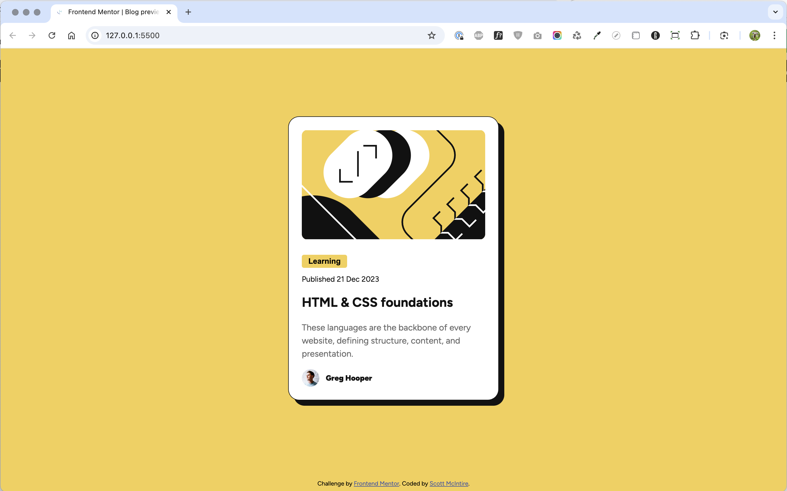

# Frontend Mentor - Blog preview card solution

This is a solution to the [Blog preview card challenge on Frontend Mentor](https://www.frontendmentor.io/challenges/blog-preview-card-ckPaj01IcS). Frontend Mentor challenges help you improve your coding skills by building realistic projects.

## Table of contents

- [Overview](#overview)
  - [The challenge](#the-challenge)
  - [Screenshot](#screenshot)
  - [Links](#links)
- [My process](#my-process)
  - [Built with](#built-with)
  - [What I learned](#what-i-learned)
  - [Continued development](#continued-development)
- [Author](#author)

## Overview

### The challenge

Users should be able to:

- See hover and focus states for all interactive elements on the page

### Screenshot

### Links

- Solution URL: [View Code](https://github.com/ldg/blog-preview-card-main)
- Live Site URL: [Preview Solution](https://ldg.github.io/blog-preview-card-main/)

## My process

### Built with

- Semantic HTML5 markup
- CSS custom properties
- Flexbox
- CSS Grid
- Mobile-first workflow
- [Sass](https://sass-lang.com/)

### What I learned

I used this project to practice Sass. I set up Sass using the Sass command line to link the scss and css files and to watch the files. Additionally, I set up a Sass Function to convert px to rem, or px to em; and used it throught the project.

### Continued development

My intention is to work through the Learning Paths to continue gaining experiance setting up projects and completing them. Javascript is an ongoing challenge for me, I plan to start learning React when I feel more comfortable with using vanilla Javascript.

## Author

- Frontend Mentor - [@ldg](https://www.frontendmentor.io/profile/ldg)
